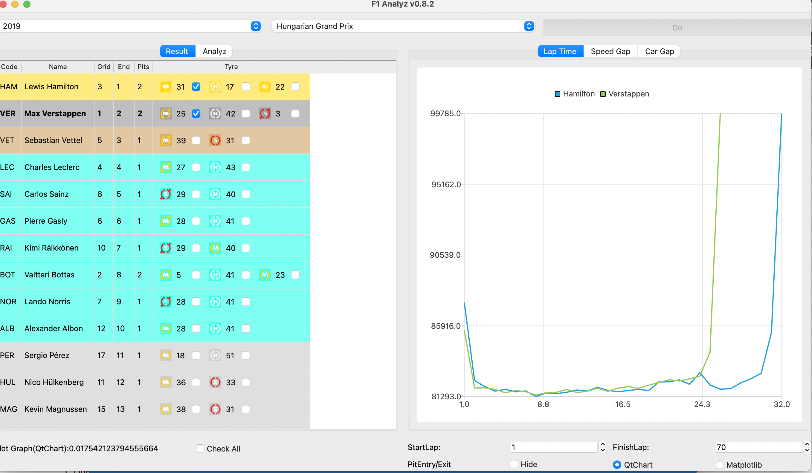

### Notes
This project is really aged and is written during my early period of python learning. 

I am so proud of myself back then, for being driven by pure passion -- the love for Formula One,  to finish a small project like this. Nevertheless, the code is really antiquidated and needs to be updated, at least in several following dimensions:

1. PyQt5 will soon be irrelevant, update the code to compat PyQt6
2. Deprecate local db as mysql2sqlite is no longer in active maintenance, and the script is much too slow. Use fastf1 api instead.
3. Some code improvements in terms of line plotting.

Requirements

`$ pip3 install pyqt6 requests matplotlib bitarray pymysql pyqt6-charts`

You may set up a native MySQL environment, and create the needed database via the .sql file provided by ergast.com.
I've used the [mysql2sqlite](https://github.com/dumblob/mysql2sqlite) to generate a sqlite db, and you may download the db that comes with  version on the main branch.

Currently some data in 1996 is not available.

Changes made to the database:

    Aug 12 2019:
    
    Add missing pitstop for car 44 in race 1020
    Add table stint

Database last update: Aug 12 2019

After installing the requirements, and having a f1.db file under project directory, you may run

`$ python3 gui.py`

to start the software.

Current version: 0.7.0 

The project is in a very early stage, and a lot of features and algorithms are needed. Any king of help is greatly appreciated!

## Code

The GUI is made with the python3 implementation of Qt -- PyQt6.

The Initial thought of this project is to take a deeper dive into the F1.

